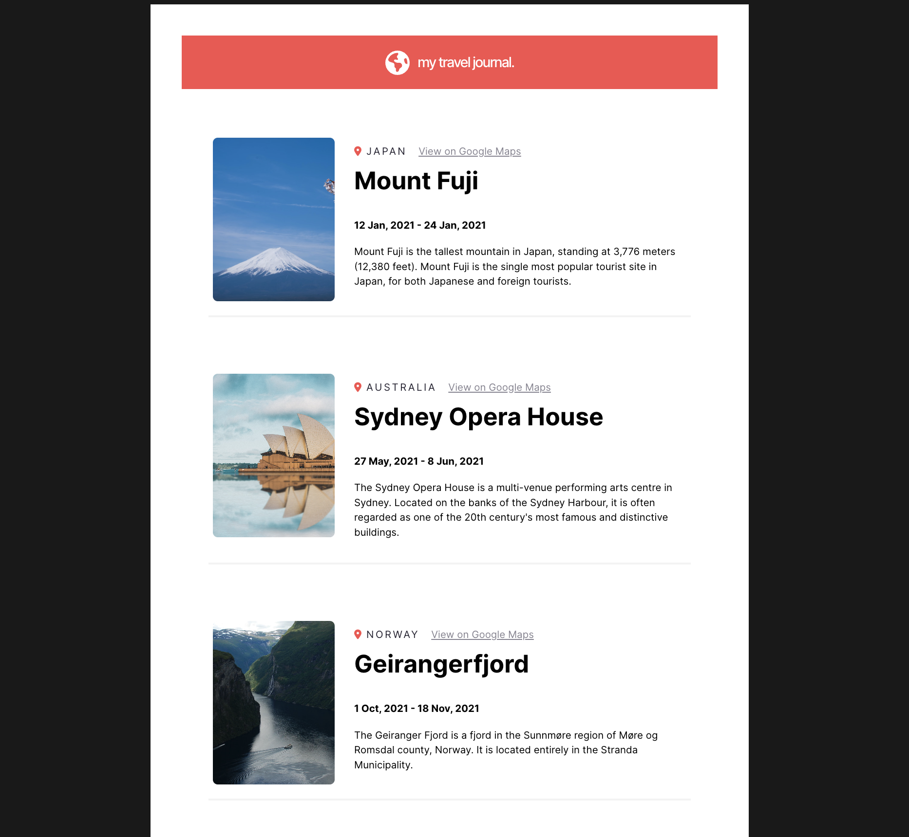

# Travel Journal


## Introduction

This is a travel journal that is implemented in React.js using Vite.
It is built ground up following a given [Figma design](https://www.figma.com/design/Jk9STx5aMuLdNSls1WdStq/Travel-Journal-(Copy)?t=smETjE0OwJb0ZeEX-0) to test my skills with props and custom CSS.

The photos from the original design have been replaced because they can no logner be located

## Features

The Web App has 2 main React components, the static nav bar on the top and a series of travel cards displayed in the bottom.
Each of the cards is populated from the data using props.

## Setup

To get a local copy up and running, follow these simple steps.

1. Clone the repo
   ```sh
   git clone https://github.com/realtobyfu/travel-journal.git

2. Navigate to the project directory
   ```sh
    cd vite-react

3. Install dependencies
   ```sh
    npm install

4. Run the project locally
    ```sh
    npm run dev


